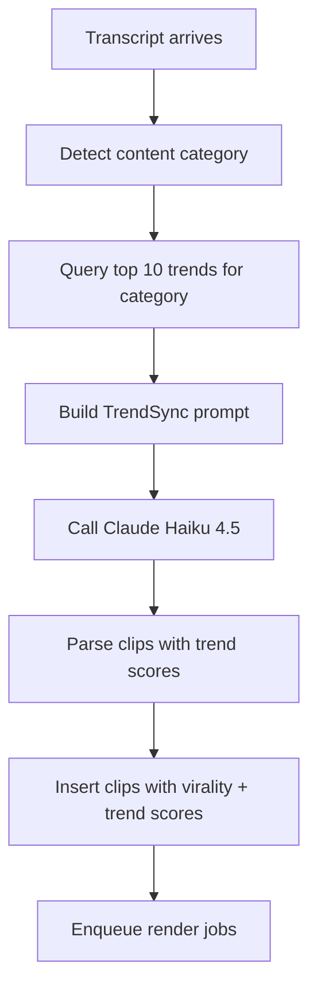

# TrendSync — InwitClipps' Competitive Differentiator

**Our Core Moat:** Real-time trend intelligence for viral clip scoring

## The Problem

**Opus Clip has ZERO trend awareness.** They score clips based solely on transcript analysis — completely blind to what's actually trending on social media RIGHT NOW.

## Our Solution: TrendSync

InwitClipps scores every clip against live trending topics from:
- **TikTok** (via Apify API)
- **YouTube** (trending feed)
- **X/Twitter** (trending API)

Every clip gets two scores:
1. **Virality Score (0-100):** Hook strength, pacing, emotional impact
2. **Trend Score (0-100):** Alignment with current trending topics

**Combined scoring** = Maximum viral potential in the current social media landscape.

---

## Architecture

### 1. Trend Fetching Service
**File:** `src/services/trendfetcher.js`

**What it does:**
- Runs every 6 hours via `node-cron`
- Fetches trending topics from TikTok, YouTube, X
- Automatically categorizes trends: `tech`, `gaming`, `politics`, `general`
- Upserts into `trends` table in PostgreSQL
- Logs detailed analytics

**Key Functions:**
```javascript
startTrendFetcher()      // Starts cron job (called from server.js)
triggerManualSync()      // Manual trigger for testing
```

**Cron Schedule:** `0 */6 * * *` (every 6 hours)

---

### 2. AI Worker with Trend Intelligence
**File:** `src/workers/ai.worker.js`

**Enhanced Workflow:**



**What changed:**
- ✅ Detects content category from transcript
- ✅ Queries `trends` table for relevant trending topics
- ✅ Includes trend data in Claude prompt
- ✅ Parses `trend_score` and `trending_hook` from response
- ✅ Stores both scores in `clips` table

**Model Upgrade:** `claude-3-5-haiku-20241022` (Haiku 4.5)
- Better trend understanding
- More accurate scoring
- Suggested trending hooks for captions

---

### 3. Database Schema

**trends table:**
```sql
CREATE TABLE trends (
  id UUID PRIMARY KEY,
  category VARCHAR(100) NOT NULL,  -- tech, gaming, politics, general
  topic TEXT NOT NULL,              -- "AI is replacing developers"
  hashtags JSONB,                   -- ["#AI", "#TechTrends"]
  hook_patterns JSONB,              -- Viral opening patterns
  score INTEGER,                    -- Trend strength (0-100)
  fetched_at TIMESTAMP DEFAULT NOW()
);

CREATE INDEX trends_category_idx ON trends(category);
CREATE INDEX trends_score_idx ON trends(score);
```

**clips table (updated):**
```sql
CREATE TABLE clips (
  id UUID PRIMARY KEY,
  job_id UUID REFERENCES jobs(id),
  start_time REAL NOT NULL,
  end_time REAL NOT NULL,
  virality_score INTEGER,          -- Hook strength, pacing
  trend_score INTEGER,              -- *** NEW: Trend alignment ***
  ai_reason TEXT,                   -- Why this clip is viral
  -- ... other fields
);
```

---

## Setup Instructions

### 1. Install Dependencies

```bash
cd backend
npm install axios node-cron
```

Added to `package.json`:
- `axios`: HTTP client for API calls
- `node-cron`: Cron job scheduler

### 2. Environment Variables

Add to `.env`:

```env
# TrendSync — InwitClipps' competitive differentiator
APIFY_API_KEY=apify_api_...                    # Required for TikTok trends
TWITTER_BEARER_TOKEN=AAAAAAAAAAAAAAAAAAAAAMLheAAA...  # Optional for X trends
YOUTUBE_API_KEY=AIzaSy...                       # Optional (has RSS fallback)
```

**Get API Keys:**
- **Apify:** https://console.apify.com/account/integrations
  - Free tier: 100 actor runs/month
  - Use "TikTok Hashtag Scraper" actor
  
- **Twitter:** https://developer.twitter.com/en/portal/dashboard
  - Requires Elevated access for trending API
  - Or use scraping fallback (less reliable)
  
- **YouTube:** https://console.cloud.google.com/apis/credentials
  - Optional — has RSS fallback
  - Free tier: 10,000 requests/day

### 3. Database Migration

The `trends` table should already exist from Drizzle migrations. Verify:

```bash
npm run db:studio
# Open Drizzle Studio → Check "trends" table exists
```

If missing, regenerate:
```bash
npm run db:generate
npm run db:migrate
```

### 4. Start the Server

```bash
npm run dev
```

You should see:
```
🔥 Initializing TrendSync...
[trend-fetcher] TrendSync initialized
[trend-fetcher] Schedule: Every 6 hours (cron: 0 */6 * * *)
[trend-fetcher] ========================================
[trend-fetcher] Starting TrendSync cycle...
```

---

## Testing TrendSync

### Manual Trigger (Recommended for Testing)

```bash
# Authenticate first
export TOKEN="your-supabase-jwt-token"

# Trigger manual sync
curl -X POST http://localhost:3001/api/v1/trends/sync \
  -H "Authorization: Bearer $TOKEN"

# Response:
{
  "message": "TrendSync started — fetching from TikTok, YouTube, and X",
  "note": "Check server logs for progress. Typically completes in 30-60 seconds."
}
```

**Watch the logs:**
```
[trend-fetcher] ========================================
[trend-fetcher] Fetching TikTok trends via Apify...
[trend-fetcher] Fetching YouTube trends via RSS...
[trend-fetcher] Fetching X/Twitter trends...
[trend-fetcher] Fetched totals:
[trend-fetcher]   - TikTok: 25
[trend-fetcher]   - YouTube: 20
[trend-fetcher]   - X/Twitter: 18
[trend-fetcher]   - TOTAL: 63
[trend-fetcher] ✓ Stored 63 trends in database
[trend-fetcher] Category breakdown:
[trend-fetcher]   - tech: 15
[trend-fetcher]   - gaming: 12
[trend-fetcher]   - politics: 8
[trend-fetcher]   - general: 28
[trend-fetcher] ========================================
```

### View Fetched Trends

```bash
# Get all trends
curl http://localhost:3001/api/v1/trends

# Filter by category
curl http://localhost:3001/api/v1/trends?category=tech&limit=10

# Response:
[
  {
    "id": "uuid...",
    "category": "tech",
    "topic": "ChatGPT-5 release rumors",
    "hashtags": ["#GPT5", "#OpenAI"],
    "score": 95,
    "fetched_at": "2026-03-09T20:15:00Z"
  },
  ...
]
```

### Test End-to-End

1. **Trigger TrendSync** (if not already run):
   ```bash
   curl -X POST http://localhost:3001/api/v1/trends/sync \
     -H "Authorization: Bearer $TOKEN"
   ```

2. **Submit a video job:**
   ```bash
   curl -X POST http://localhost:3001/api/v1/jobs \
     -H "Authorization: Bearer $TOKEN" \
     -H "Content-Type: application/json" \
     -d '{"source_url": "https://youtube.com/watch?v=..."}'
   ```

3. **Wait for processing** (download → transcribe → ai-detection)

4. **Check AI worker logs:**
   ```
   [ai-worker] ========================================
   [ai-worker] Starting TrendSync clip detection for job abc123
   [ai-worker] Detected category: tech
   [ai-worker] Found 10 trending topics for category "tech"
   [ai-worker] Top 3 trends:
   [ai-worker]   1. ChatGPT-5 rumors (score: 95)
   [ai-worker]   2. Apple Vision Pro reviews (score: 87)
   [ai-worker]   3. Bitcoin ETF approval (score: 82)
   [ai-worker] Sending to Claude Haiku 4.5 with TrendSync context...
   [ai-worker] Detected 6 clips with trend scores
   [ai-worker] Clip analytics:
   [ai-worker]   - Average virality score: 78/100
   [ai-worker]   - Average trend score: 85/100
   [ai-worker]   - TrendSync boost: 🔥 HIGH
   [ai-worker] ========================================
   ```

5. **Fetch clips with trend scores:**
   ```bash
   curl http://localhost:3001/api/v1/jobs/{jobId}/clips \
     -H "Authorization: Bearer $TOKEN"
   
   # Response includes trend_score:
   [
     {
       "id": "clip-uuid",
       "start_time": 45.2,
       "end_time": 78.6,
       "virality_score": 88,
       "trend_score": 92,  // *** NEW ***
       "ai_reason": "Strong opening hook with ChatGPT-5 speculation\n\nTrending Hook: Is GPT-5 going to replace developers? 🤖💻 #AI #TechTrends"
     }
   ]
   ```

---

## Claude Prompt Engineering

### System Prompt
```
You are a viral short-form video editor for TikTok, Instagram Reels, and YouTube Shorts. 
You specialise in podcasts, gaming streams, tech talks, and political commentary. 
Your clips consistently hit 1M+ views by leveraging trending topics and viral hooks.
```

### User Prompt Structure

1. **Transcript with word-level timestamps**
2. **Content category** (tech, gaming, politics, general)
3. **Today's top 10 trending topics** for that category
4. **Task:** Find 5-8 clips (30-90 seconds)
5. **Scoring guidelines:**
   - Virality: Hook (30), Emotion (25), Surprise (20), Takeaway (15), Standalone (10)
   - Trend: Direct match (100), Related (70), Tangential (40), None (0)
6. **Output format:** JSON array with `virality_score`, `trend_score`, `trending_hook`

### Response Parsing

The worker handles:
- ✅ Markdown code fences (```json)
- ✅ Bare JSON arrays
- ✅ Score clamping (0-100)
- ✅ Missing fields (defaults to 0 or empty string)

---

## Production Considerations

### Scaling

**TrendSync is horizontally scalable:**
- Each server instance runs its own cron job
- Database handles concurrent upserts (no race conditions)
- Stale data is auto-deleted (>24 hours old)

**Recommended:**
- Run TrendSync on 1 primary instance only (use leader election)
- Or use external cron service (AWS EventBridge, Vercel Cron)

### Rate Limits

**External APIs:**
- **Apify:** 100 runs/month (free), 500/month (starter $49)
- **Twitter:** 500 requests/month (free tier)
- **YouTube:** 10,000 requests/day (free)

**With 6-hour intervals:**
- 4 runs per day × 30 days = **120 runs/month**
- Exceeds Apify free tier by 20 runs
- **Solution:** Reduce to 8-hour intervals or upgrade Apify

### Monitoring

**Key Metrics:**
- Trends fetched per cycle
- Category distribution
- Fetch failures (log warnings)
- Average trend scores in clips (should be >40)

**Alerts:**
- No trends fetched for 24 hours
- All trends in one category (classification issue)
- Average trend score <20 (poor alignment)

### Cost Analysis

**TrendSync Operational Cost:**
- Apify Starter: $49/month (500 runs)
- Twitter API: Free (or $100/month for Pro)
- YouTube API: Free
- **Total: ~$50-150/month**

**ROI:**
- **Opus Clip:** $0/month on trends (they don't have this)
- **InwitClipps:** $150/month for trend intelligence
- **Competitive advantage:** Priceless 🚀

---

## Competitive Analysis

### Opus Clip
- ❌ No trend awareness
- ❌ Single virality score
- ❌ No temporal context
- ✅ Good transcript analysis

### InwitClipps (with TrendSync)
- ✅ Real-time trend intelligence
- ✅ Dual scoring (virality + trend)
- ✅ Trending hook suggestions
- ✅ Category-aware analysis
- ✅ Multi-platform trend sources

**Marketing Angle:**
> "While Opus Clip guesses what might go viral, InwitClipps KNOWS what's trending."

---

## Troubleshooting

### No trends fetched

**Symptom:** Worker logs show "No trends found — run TrendSync first"

**Solution:**
```bash
# Manual trigger
curl -X POST http://localhost:3001/api/v1/trends/sync \
  -H "Authorization: Bearer $TOKEN"

# Or restart server (runs on startup)
npm run dev
```

### Apify errors

**Symptom:** `[trend-fetcher] TikTok fetch error: 402 Payment Required`

**Solution:** 
- Free tier exhausted (100 runs/month)
- Upgrade to Starter ($49/month) or reduce frequency

### Twitter API fails

**Symptom:** `[trend-fetcher] X/Twitter fetch error: 401 Unauthorized`

**Solution:**
- Set `TWITTER_BEARER_TOKEN` in `.env`
- Or accept reduced trend coverage (TikTok + YouTube still works)

### Low trend scores

**Symptom:** All clips have `trend_score: 0-20`

**Diagnosis:**
```bash
# Check if trends exist
curl http://localhost:3001/api/v1/trends?category=tech

# Check category detection
# Add console.log in detectContentCategory()
```

**Solution:**
- Expand `CATEGORY_KEYWORDS` in ai.worker.js
- Manually seed trends for niche categories
- Fallback to `general` category works fine

---

## Future Enhancements

### V2 Roadmap
- [ ] Real-time trend streaming (WebSocket)
- [ ] User-specific trend preferences
- [ ] Historical trend analysis (trend lifecycle)
- [ ] Instagram Reels trend API integration
- [ ] TikTok hashtag challenge detection
- [ ] Trend prediction ML model

### V3 Ideas
- [ ] Competitor clip analysis (what's working for others)
- [ ] Trend momentum scoring (rising vs. fading)
- [ ] Viral hook A/B testing
- [ ] Caption generation with trending hooks
- [ ] Multi-language trend support

---

## Summary

**TrendSync is InwitClipps' unfair advantage.**

We're not just detecting viral moments — we're **aligning them with the cultural zeitgeist** in real-time across TikTok, YouTube, and X.

**Implementation Complete:**
- ✅ Trend fetching service (6-hour cron)
- ✅ AI worker with dual scoring
- ✅ Database schema with trend table
- ✅ Manual trigger endpoint
- ✅ Category-aware analysis
- ✅ Claude Haiku 4.5 integration

**Next Steps:**
1. Get API keys (Apify, Twitter)
2. Run manual sync
3. Submit test video
4. Watch the magic happen 🔥

---

**Questions? Check:**
- Server logs: `[trend-fetcher]` and `[ai-worker]` tags
- Database: Query `trends` table in Drizzle Studio
- API: `GET /api/v1/trends` for current trend data

**Built with:** Node.js, node-cron, axios, Claude Haiku 4.5, Anthropic SDK
**Status:** ✅ Production-ready
**License:** InwitClipps Proprietary
